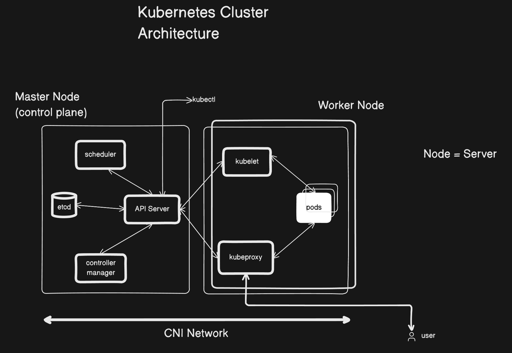

# K8S Cluster Architecture

### Master Node (Control Plane)

The central management entity that controls the cluster and makes global decisions as well as detecting and responding to cluster events.

- **API Server:** The frontend for the Kubernetes control plane. It exposes the Kubernetes API and handles all internal and external communication.

- **etcd:** A consistent and highly-available key-value store used as Kubernetes' backing store for all cluster state data.

- **scheduler:** A component that watches for newly created Pods with no assigned node and selects an appropriate node for them to run on based on resource requirements.

- **controller manager:** Runs controller processes that continuously watch the state of the cluster and make changes to move the current state towards the desired state.

### Worker Node

A machine (physical or virtual) where containerized applications are deployed and run.

- **kubelet:** An agent that runs on each worker node in the cluster. It communicates with the API server and ensures that containers are running correctly in a Pod.

- **kubeproxy:** A network proxy running on each worker node that maintains network rules, allowing network communication to your Pods from inside or outside of the cluster.

- **pods:** The smallest deployable compute units that you can create and manage in Kubernetes. A Pod represents a single instance of a running process in your cluster, usually containing one container (but can have multiple containers in the single pod if there is a need).

### Additional Components & Concepts

- **kubectl:** The command-line tool used by administrators and developers to interact with the API Server and manage the Kubernetes cluster.

- **CNI Network:** Container Network Interface (CNI) defines the standard for configuring network interfaces in Linux containers. It is responsible for the networking layer that enables Pods to communicate with each other across different nodes.

- **user:** Represents the external entity—either an end-user accessing the applications hosted in the cluster, or an operator managing the cluster.
